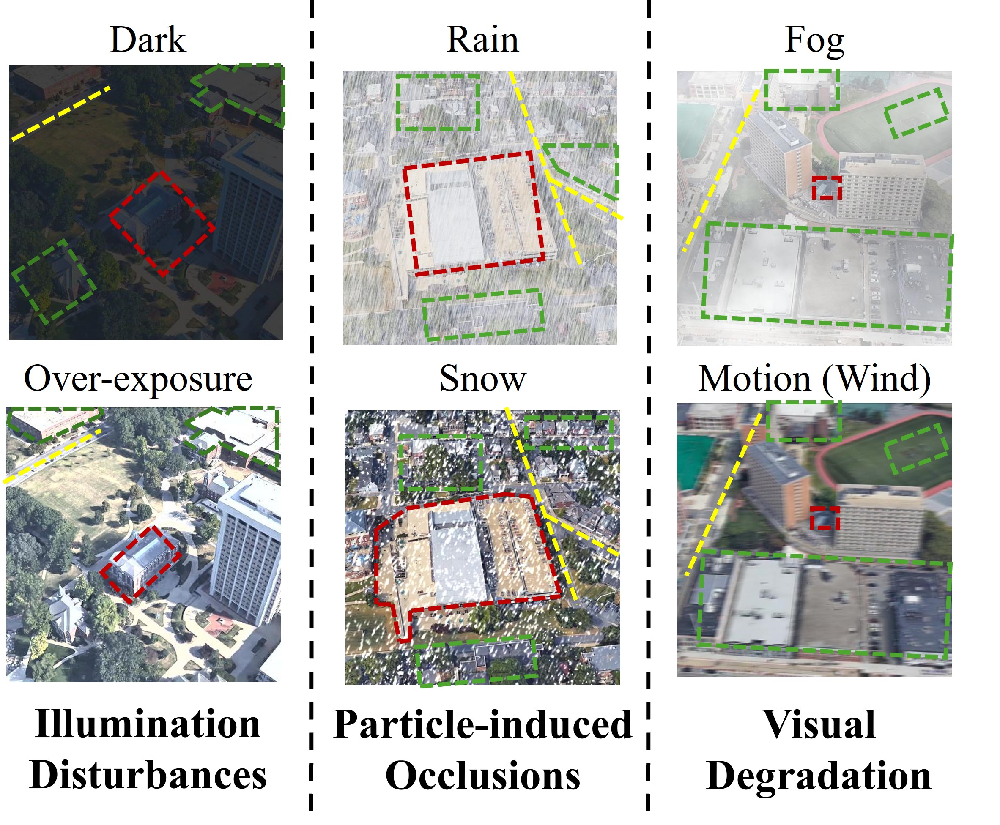

# FANet
[IEEE Transactions on Image Processing'26] Pytorch implementation of FANet: Fovea Attention Network for Robust Aerial Geo-localization Across Diverse Weather Conditions.

**More details can be found at our paper: [FANet: Fovea Attention Network for Robust Aerial Geo-localization Across Diverse Weather Conditions](https://www.zdzheng.xyz/files/2026/TIP_FANet.pdf)**

<div align="center"></div>

**Code Release**: We plan to fully release the PyTorch implementation of FANet, including training and evaluation code, around **June 2026**.

**CUDA Memory**: We recommend using a GPU with at least **24 GB** of memory. Our experiments were conducted on an **NVIDIA RTX A6000** GPU.

---

## News

- **[2026-04-24]** Paper Accepted.
- **[2026-06-21]** The [Dockerfile](#docker) is now available.
- **[2026-06-22]** The checkpoints have been released at [Baidu Yun](https://pan.baidu.com/s/1CIbpjns73TEY572ofyXxCg?pwd=qh43)[qh43]！
- **[Coming Soon]** The code will be released around June 2026.

---
## TODO 

- [x] Provide environment configuration files, including `requirements.txt`
- [x] Provide Dockerfile and containerized running instructions
- [x] Release pretrained model weights and runtime assets
- [ ] Release testing and evaluation scripts
- [ ] Release training scripts
- [ ] Provide dataset preparation instructions and preprocessing scripts
- [ ] Provide complete reproduction instructions for the main experimental results

---

## Important Note

We are currently occupied with several ongoing research and project commitments.
Therefore, the related code and resources are still being organized and are not ready for full public release at this stage.

We plan to release the **complete training and testing code** by **June**, together with pretrained weights, environment configuration files, and Docker support.

Before the official release, **please do not email us to request the Code**, as we may not be able to respond to such requests individually.

Thank you for your understanding and support.

---

## Installation

Create a Python environment and install dependencies:

```bash
pip install -r requirements.txt
```

---


## Organize dataset folder as follows:

```
|-- dataset/
|    |-- University-Release/
|        |-- test/
|            |-- query_drone/
|            |-- query_satellite/
|            |-- ...
|        |-- train/
|            |-- drone/
|            |-- satellite/
|            |-- ...
|    |-- SUES/
|        |-- Training/
|            |-- 150/
|            |-- 200/
|            |-- ...
|        |-- Testing/
|            |-- 150/
|            |-- 200/
|            |-- ...
|    |-- CVUSA/
|        |-- train/
|            |-- satellite/
|            |-- street/
|        |-- val/
|            |-- satellite/
|            |-- street/
```

---

## Models and Weights
*  The **Models** and **Weights** are released.
* Download The Trained Model Weights:[Baidu Yun](https://pan.baidu.com/s/1CIbpjns73TEY572ofyXxCg?pwd=qh43)[qh43].

Organize `SAM` folder as follows:

```
|-- segment/
|    |-- checkpoint/
|        |-- sam_vit_h_4b8939.pth
|    |-- segment_anything/
|    |-- ...
|-- image_folder.py/
|-- model.py/
|-- ...
```


---

## Training

Before training, place the required pretrained files:

```text
resnet50-0676ba61.pth
resnet50_ibn_a-d9d0bb7b.pth
segment/segment_anything/
segment/checkpoint/sam_vit_h_4b8939.pth
```

Run:

```bash
python train.py \
  --name fanet_best_reproduce \
  --experiment_name fanet_best_reproduce \
  --data_dir /path/to/University-Release/train \
  --views=3 \
  --droprate=0.5 \
  --extra_Google \
  --share \
  --stride=1 \
  --h=256 \
  --w=256 \
  --lr=0.005 \
  --gpu_ids=0 \
  --norm=spade \
  --iaa \
  --focal \
  --multi_weather \
  --btnk 0 1 1 0 0 0 0 \
  --conv_norm=none \
  --reptile \
  --adain=a \
  --seed=1
```

Training outputs are written to:

```text
model/fanet_best_reproduce/
log/fanet_best_reproduce/
```

## Evaluation

Before evaluation, place the final checkpoint at:

```text
model/best_ckpt/net_best.pth
```

Run dark-weather D2S evaluation:

```bash
python test_iaa_all.py \
  --name best_ckpt \
  --test_dir /path/to/University-Release/test \
  --batchsize 128 \
  --gpu_ids 0 \
  --iaa \
  --weather dark \
  --modes d2s
```

## Notes

- Source code is released without datasets or large checkpoint files.
- Use the paths above as examples and replace them with local dataset locations.

---


## Docker

Two Docker images are available on GitHub Container Registry:

- `ghcr.io/jahawn-wen/fanet:train`: training image.
- `ghcr.io/jahawn-wen/fanet:best`: evaluation image with the best checkpoint.

### Training

```bash
docker pull ghcr.io/jahawn-wen/fanet:train

docker run --gpus '"device=0"' --ipc=host -it --rm \
  -e GPU_IDS=0 \
  -e FANET_RUN_NAME=fanet_train \
  -v /absolute/path/to/University-Release/train:/data/train:ro \
  -v /absolute/path/to/fanet_outputs:/outputs \
  ghcr.io/jahawn-wen/fanet:train \
  train-fanet
```

Training outputs are saved under:

```text
/outputs/model/<FANET_RUN_NAME>/
/outputs/log/<FANET_RUN_NAME>/
```

### Evaluation

```bash
docker pull ghcr.io/jahawn-wen/fanet:best

docker run --gpus all --ipc=host -it --rm \
  -v /absolute/path/to/University-Release/test:/data/test:ro \
  ghcr.io/jahawn-wen/fanet:best \
  python test_iaa_all.py \
    --name best_ckpt \
    --test_dir /data/test \
    --batchsize 128 \
    --gpu_ids 0 \
    --iaa \
    --weather dark \
    --modes d2s
```


### Docker Notes

- The dataset is not included in the images.
- NVIDIA Container Toolkit is required for GPU support.

---

## Reference
If you use FANet in your research, please cite it by the following BibTeX entry:

```bibtex

@article{wen2026fanet,
  title={FANet: Fovea Attention Network for Robust Aerial Geo-localization Across Diverse Weather Conditions},
  author={Wen, Jiahao and Yu, Hang and Zheng, Zhedong},
  journal={IEEE Transactions on Image Processing},
  year={2026},
  publisher={IEEE}
}


```

## ✨ Acknowledgement
- Our code is based on [MuseNet](https://github.com/wtyhub/MuseNet/tree/master)
- [segment-anything](https://github.com/facebookresearch/segment-anything): Thanks a lot for the foundamental efforts!
